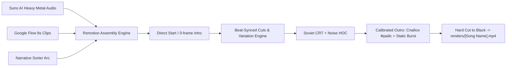

# Spicy Frys Architecture & Pipeline

This document defines the architectural standards, variation engine, and component breakdown for the **Spicy Frys** (`Спайси Фрайс`) Remotion engine.

---

## 1. Pipeline Overview

---

## 2. Component Directory Breakdown

### `src/components/effects/`
- `SovietCRTWrapper.tsx`: Top-level HOC that wraps the visual sequence in CRT raster scanlines, chromatic RGB aberration, barrel distortion vignette, and muted pastel CSS color matrix filters.
- `NoiseCanvasOverlay.tsx`: Real-time noise generator powered by `@remotion/noise` (`noise2D`/`noise3D`), simulating film grain and magnetic tape decay.
- `VHSSpliceTransition.tsx`: Simulates momentary tracking tear, vertical roll, and scanline jitter during hard cuts between clips.

### `src/components/sequencer/`
- `BeatSyncedSequencer.tsx`: Core engine component that takes the registered Google Flow 8-second clips in narrative order, calculates hard cut intervals (4–8s) aligned with beat markers, loops them across arbitrary-length tracks (>180s) without gaps, and applies dynamic visual variations (`zoom-in`, `mirror-punch`, `static-crop`, `vhs-heavy`) on repeated cycles.

### `src/components/outro/`
- `SovietOutro.tsx`: Renders the brutalist outro block featuring **"Спайси Фрайс"** using heavy industrial typography, accompanied by a calibrated (non-ear-splitting) analog static burst, cutting abruptly to pitch black.

### `src/lib/`
- `audio.ts`: Procedural WAV synthesizer providing high-frequency hiss, startup pop, and heavy aggressive static noise bursts for outro transmission cutoff.
- `beatSync.ts`: Mathematical helpers for beat calculation, bar subdivision, clip cut scheduling, and variation cycle assignment.

### `scripts/`
- `sync-assets.mjs`: Scans `assets/videos` and `assets/musics`, sorts video assets into narrative order based on thematic keywords, measures WAV duration, and generates `src/config/spicyFrysAssets.ts`.
- `render-video.mjs`: Orchestrates asset synchronization and renders the final video with the exact song title as filename (`renders/[Song Name].mp4`).
